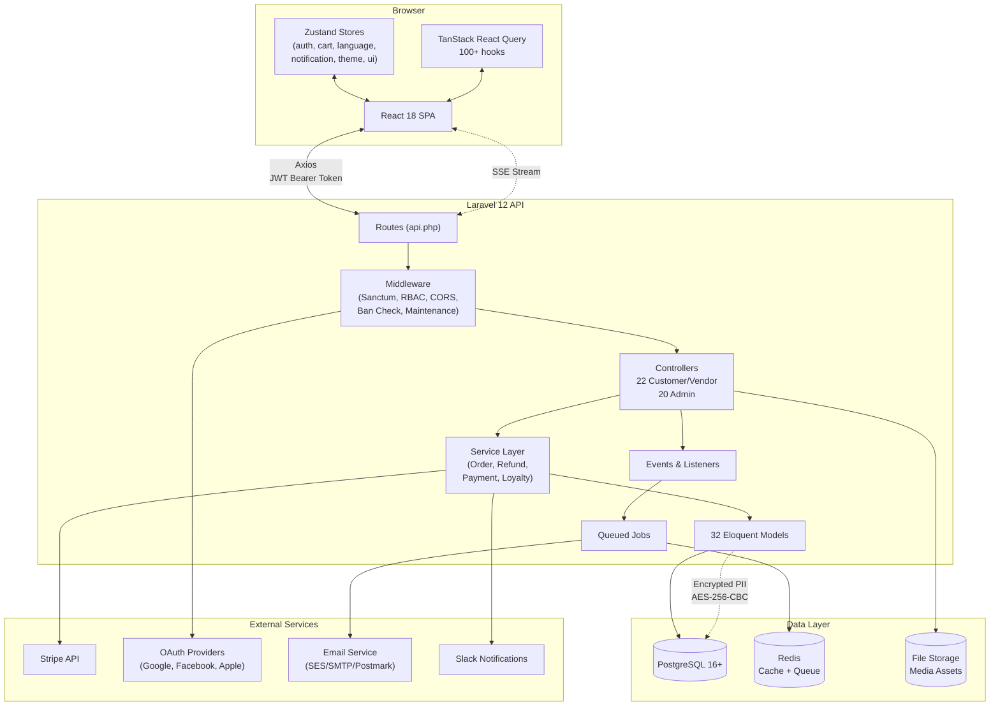
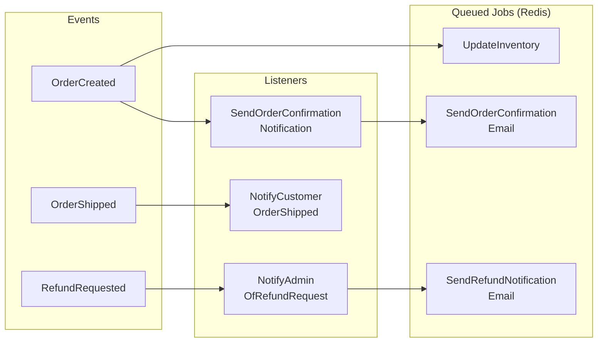
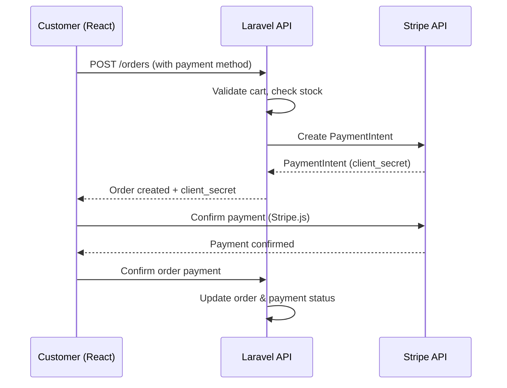

# Mini-Amazon E-commerce Marketplace — Full Documentation

Comprehensive technical documentation for the Mini-Amazon E-commerce Marketplace — a production-grade, multi-vendor e-commerce platform built with Laravel 12 (PHP 8.2+) and React 18.

---

## Table of Contents

1. [Features Overview](#features-overview)
2. [Tech Stack](#tech-stack)
3. [Architecture & Project Structure](#architecture--project-structure)
4. [Database Schema](#database-schema)
5. [Getting Started](#getting-started)
6. [Environment Variables](#environment-variables)
7. [API Reference](#api-reference)
8. [Authentication & Authorization](#authentication--authorization)
9. [Data Encryption & Security](#data-encryption--security)
10. [Frontend Architecture](#frontend-architecture)
11. [Service Layer & Business Logic](#service-layer--business-logic)
12. [Payment Integration](#payment-integration)
13. [Internationalization (i18n)](#internationalization-i18n)
14. [Theming & UI Customization](#theming--ui-customization)
15. [Testing & CI/CD](#testing--cicd)
16. [Deployment, Scripts & Contributing](#deployment-scripts--contributing)

---

## Features Overview

### Customer (Buyer)

- Hero banner slider with auto-rotation
- Product browsing with advanced filtering (category, brand, price range, rating, sort)
- Search autocomplete with debounce
- Product detail with image gallery, zoom on hover, variant selection
- Reviews — submit, edit, delete with star ratings
- Shopping cart — guest support (localStorage), authenticated sync, variant-aware, coupon codes
- Multi-step checkout — address management, payment cards, wallet payment (full/partial + COD), coupon validation
- Order management — list, detail, cancel, request refund
- Wishlist and product comparison (up to 4 side-by-side)
- Digital wallet — balance, top-up, transaction history
- Loyalty points — earn and redeem with configurable rate
- Customer-to-merchant real-time messaging
- SSE (Server-Sent Events) live notifications with 30s fallback polling
- Profile management — avatar upload, password change, 2FA toggle, address book, payment cards
- Affiliate program — apply and status tracking
- Recently viewed products tracking (max 20)
- Mobile-responsive design with bottom navigation bar

### Merchant (Vendor)

- Dashboard with Recharts analytics (revenue, orders, product stats)
- Product CRUD with 5 product types: Simple, Variable, Digital, Catalog, Classified
- Rich text descriptions (React Quill), multi-image upload (React Dropzone), product variants and attributes
- Order management with status updates
- Earnings tracking with payout request system
- Review management with seller replies
- Customer messaging
- Store settings — business info, shipping rates, free shipping thresholds
- Category and brand request submissions (for new categories/brands)
- Product reconsideration requests (if rejected by admin)

### Admin (27 pages, permission-gated)

- Analytics dashboard with Recharts visualizations
- User management — CRUD, ban/unban
- Merchant management — approve/reject/suspend vendors, payout processing
- Product management — CRUD, approve/reject vendor products, moderation
- Category management — hierarchical CRUD
- Brand management — CRUD with images
- Review moderation — approve/reject
- Order management and oversight
- Shipping configuration
- Finance management — wallets, transactions, payout approvals
- Refund processing — approve/reject
- Marketing tools — campaigns, coupons, flash deals, newsletter subscribers, bulk SMS
- Affiliate management
- Rewards/loyalty system management
- Wholesale customer and product management
- Point of Sale (POS) system — full POS interface
- Chat/messaging management — monitor, block, delete
- CMS — blog posts, static pages
- Media library — file upload, bulk delete
- Storefront configuration
- Live theme customization — 7 presets + custom colors with live preview
- Reporting — sales, inventory, customers, financial (tabbed)
- Staff management — CRUD, role-based access with 74 granular permissions
- Settings — comprehensive site settings, maintenance mode
- System monitoring and health

### Platform-Level Features

- Full bilingual support — Arabic (RTL, default) + English (LTR)
- Dynamic theming — 17 CSS custom property color tokens, 7 presets (ivory, amazon, midnight, emerald, rose, ocean, sunset), server-driven
- SEO optimization — meta tags, Open Graph, Twitter Cards, canonical URLs, structured data
- Facebook Pixel integration — page views, custom events
- Server-Sent Events (SSE) for real-time updates (notifications, messages) with polling fallback
- AES-256-CBC PII encryption at rest with HMAC blind indexes for searchability
- Social OAuth — Google, Facebook, Apple
- OTP authentication and 2FA
- Error boundary with fallback UI
- Skeleton loading states for all data sections
- Mobile-first responsive design
- Dark mode support
- Dynamic favicon and site name from server settings
- Admin-configurable announcement bar
- Maintenance mode display

---

## Tech Stack

### Backend

| Component | Technology | Version |
|-----------|------------|---------|
| Framework | Laravel | 12 (PHP 8.2+) |
| Database | PostgreSQL | 16+ (MySQL fallback) |
| Cache | Redis | phpredis driver |
| Queue | Redis | with job tables fallback |
| Session | Database-driven | — |
| Authentication | Laravel Sanctum | Token-based, 24h expiry |
| Authorization | Spatie Permission | v7 — 74 permissions, 3+ roles |
| Social Auth | Laravel Socialite | Google, Facebook, Apple |
| Payment | Stripe | stripe/stripe-php |
| HTTP Client | Guzzle | v7 |
| Email | Configurable | SMTP / AWS SES / Postmark / Resend |
| Notifications | Slack Bot | Backend alerts |
| Testing | PHPUnit | 11.5 |
| Dev Environment | Laravel Sail | Docker-based |
| Asset Bundling | Vite 7 + Tailwind CSS 4 | — |

### Frontend

| Component | Technology | Version |
|-----------|------------|---------|
| Framework | React | 18.3.1 |
| Build Tool | Vite | 7.3.1 |
| Styling | Tailwind CSS | v4.2.1 |
| State Management | Zustand | 5.0.11 (persisted to storage) |
| Server State | TanStack React Query | 5.90.21 |
| Routing | React Router DOM | 7.13.1 |
| HTTP Client | Axios | 1.13.5 |
| Forms | React Hook Form + Zod | 7.71.2 / 4.3.6 |
| Icons | Lucide React + React Icons | 0.575.0 / 5.5.0 |
| Charts | Recharts | 3.7.0 |
| Maps | Leaflet + React-Leaflet | 1.9.4 / 4.2.1 |
| Rich Text Editor | React Quill | 2.0.0 |
| File Upload | React Dropzone | 15.0.0 |
| Date Picker | React DatePicker | 9.1.0 |
| Select | React Select | 5.10.2 |
| Sanitization | DOMPurify | 3.3.1 |
| Date Handling | date-fns | 4.1.0 |
| Toasts | React Hot Toast | 2.6.0 |

---

## Architecture & Project Structure

### System Architecture



### Directory Structure

```
Mini-Amazon-ecommerce-marketplace/
├── backend/                            # Laravel 12 REST API
│   ├── app/
│   │   ├── Casts/                      # Custom Eloquent casts
│   │   │   ├── EncryptedString.php     # AES-256-CBC string encryption
│   │   │   ├── EncryptedArray.php      # AES-256-CBC array encryption
│   │   │   └── EncryptedDate.php       # AES-256-CBC date encryption
│   │   ├── Events/                     # Domain events
│   │   │   ├── OrderCreated.php
│   │   │   ├── OrderShipped.php
│   │   │   └── RefundRequested.php
│   │   ├── Http/
│   │   │   ├── Controllers/Api/        # 22 customer/vendor API controllers
│   │   │   │   └── Admin/              # 20 admin API controllers
│   │   │   ├── Middleware/             # 5 custom middleware
│   │   │   │   ├── EnforceForceHttps.php
│   │   │   │   ├── EnforceMaintenanceMode.php
│   │   │   │   ├── HydrateSettingsFromStorage.php
│   │   │   │   └── ... (not-banned, admin-panel-access)
│   │   │   ├── Requests/               # Form request validation classes
│   │   │   └── Resources/              # 14 API resource transformers
│   │   ├── Jobs/                       # Queued async jobs
│   │   │   ├── SendOrderConfirmationEmail.php
│   │   │   ├── SendRefundNotificationEmail.php
│   │   │   └── UpdateInventory.php
│   │   ├── Listeners/                  # Event listeners
│   │   │   ├── SendOrderConfirmationNotification.php
│   │   │   ├── NotifyCustomerOrderShipped.php
│   │   │   └── NotifyAdminOfRefundRequest.php
│   │   ├── Models/                     # 32 Eloquent models
│   │   ├── Policies/                   # Authorization policies
│   │   │   ├── OrderPolicy.php
│   │   │   └── ProductPolicy.php
│   │   ├── Providers/                  # Service providers
│   │   ├── Services/                   # Business logic layer
│   │   │   ├── OrderService.php
│   │   │   ├── RefundService.php
│   │   │   ├── PaymentService.php
│   │   │   └── LoyaltyPointService.php
│   │   └── Support/                    # Helpers
│   │       ├── SensitiveData.php
│   │       └── CollectionPaginator.php
│   ├── config/                         # Application configuration
│   ├── database/
│   │   └── migrations/                 # 57 migration files
│   ├── routes/
│   │   └── api.php                     # All API route definitions (/api/v1/)
│   ├── scripts/                        # 9 diagnostic/debug PHP scripts
│   ├── storage/app/settings/           # Runtime platform settings (JSON)
│   ├── tests/                          # PHPUnit test suites
│   ├── composer.json
│   ├── phpunit.xml
│   └── vite.config.js
├── frontend/                           # React 18 SPA
│   ├── src/
│   │   ├── main.jsx                    # App entry — StrictMode, BrowserRouter, QueryClient, ErrorBoundary
│   │   ├── App.jsx                     # 718 lines — 67 routes, lazy loading, auth guards
│   │   ├── index.css                   # Tailwind @theme, CSS custom properties, RTL support
│   │   ├── api/
│   │   │   ├── axios.js                # Axios instance — /api/v1, Bearer token, 401/403 handling
│   │   │   └── services.js             # 372 lines — 17 API service objects
│   │   ├── store/                      # 6 Zustand stores
│   │   │   ├── authStore.js            # Auth state — login, register, OTP, social, roles
│   │   │   ├── cartStore.js            # Cart — items, coupons, guest sync, optimistic updates
│   │   │   ├── languageStore.js        # AR/EN language toggle
│   │   │   ├── notificationStore.js    # Notification management
│   │   │   ├── themeStore.js           # 7 preset themes, 17 color tokens
│   │   │   └── uiStore.js              # Sidebar, search, compare (max 4), recently viewed (max 20)
│   │   ├── hooks/                      # 8 custom hooks
│   │   │   ├── useApi.js               # 1685 lines — 100+ React Query hooks
│   │   │   ├── useDebounce.js
│   │   │   ├── useFacebookPixel.js
│   │   │   ├── useLiveUpdates.js       # SSE real-time + 30s polling fallback
│   │   │   ├── usePermission.js        # Admin permission checks
│   │   │   ├── useSEO.js               # Dynamic <head> meta tags
│   │   │   ├── useSellerCtaPath.js
│   │   │   └── useTranslation.js       # i18n with dot-notation keys
│   │   ├── i18n/
│   │   │   ├── ar.js                   # Arabic translations (116KB)
│   │   │   └── en.js                   # English translations (90KB)
│   │   ├── lib/
│   │   │   ├── adminAccess.js          # 22 route-permission mappings
│   │   │   ├── categoryFilters.js      # Category filter configs (35KB)
│   │   │   ├── facebookPixel.js        # FB Pixel initialization
│   │   │   ├── orderShippingMeta.js    # Order shipping metadata
│   │   │   └── utils.js                # Helpers: cn(), formatCurrency(EGP), formatDate, slugify
│   │   ├── layouts/
│   │   │   ├── CustomerLayout.jsx      # Header + Footer + ComparisonDrawer + MobileBottomNav
│   │   │   ├── AuthLayout.jsx          # Centered minimal layout
│   │   │   ├── DashboardLayout.jsx     # Sidebar + Header (shared Admin/Merchant)
│   │   │   ├── AdminLayout.jsx         # 25+ menu items, permission-filtered
│   │   │   └── MerchantLayout.jsx      # 7 merchant menu items
│   │   ├── components/
│   │   │   ├── layout/                 # CustomerHeader (40KB), CustomerFooter, DashboardHeader, DashboardSidebar
│   │   │   ├── ui/                     # 24 reusable components (Avatar, Badge, Button, Card, Modal, Table, etc.)
│   │   │   ├── ComparisonDrawer.jsx    # Product comparison side drawer
│   │   │   ├── ErrorBoundary.jsx       # Global error boundary
│   │   │   ├── ImageZoom.jsx           # Product image zoom on hover
│   │   │   ├── MobileBottomNav.jsx     # Mobile bottom navigation
│   │   │   ├── RecentlyViewedBar.jsx   # Recently viewed products
│   │   │   ├── ScrollToTop.jsx         # Floating scroll-to-top
│   │   │   └── SearchAutocomplete.jsx  # Search suggestions with debounce
│   │   └── pages/
│   │       ├── auth/                   # 5 pages — Login, Register, ForgotPassword, MerchantRegister, SocialCallback
│   │       ├── customer/               # 27 pages — Home, Products, Cart, Checkout, Orders, Wallet, etc.
│   │       ├── merchant/               # 8 pages — Dashboard, Products, Orders, Earnings, Reviews, etc.
│   │       └── admin/                  # 27 pages — Dashboard, Users, Merchants, Products, POS, CMS, etc.
│   ├── index.html
│   ├── package.json
│   └── vite.config.js                  # Proxy: /api → localhost:8000, port 3000
└── README.md
```

---

## Database Schema

### Custom PostgreSQL Enum Types

The database defines 5 custom enum types for strict value enforcement:

| Enum Type | Values |
|-----------|--------|
| `order_status` | `pending`, `confirmed`, `processing`, `shipped`, `delivered`, `cancelled`, `returned`, `refunded` |
| `payment_status` | `pending`, `completed`, `failed`, `refunded` |
| `shipment_status` | `pending`, `processing`, `shipped`, `in_transit`, `delivered`, `returned` |
| `loyalty_type` | `earned`, `redeemed`, `expired`, `deducted` |
| `coupon_type` | `percentage`, `fixed` |

### Entity-Relationship Diagram

```mermaid
erDiagram
    users ||--o| vendors : "has one"
    users ||--o| wallets : "has one"
    users ||--o{ addresses : "has many"
    users ||--o{ orders : "has many"
    users ||--o{ reviews : "has many"
    users ||--o{ cart_items : "has many"
    users ||--o{ wishlists : "has many"
    users ||--o{ payment_cards : "has many"
    users ||--o{ loyalty_points : "has many"
    users ||--o{ user_notifications : "has many"
    users ||--o{ affiliates : "has one"
    users ||--o| wholesale_customers : "has one"

    vendors ||--o{ products : "has many"
    vendors ||--o{ conversations : "has many"
    vendors ||--o{ vendor_payout_requests : "has many"
    vendors ||--o{ category_requests : "has many"
    vendors ||--o{ brand_requests : "has many"

    products ||--o{ product_variants : "has many"
    products ||--o{ product_attributes : "has many"
    products ||--o{ reviews : "has many"
    products ||--o{ order_items : "has many"
    products ||--o{ wishlists : "has many"
    products ||--o{ cart_items : "has many"
    products ||--o| wholesale_products : "has one"
    products ||--o{ product_reconsideration_requests : "has many"
    products }o--|| categories : "belongs to"
    products }o--|| brands : "belongs to"

    categories ||--o{ categories : "parent/children"

    orders ||--o{ order_items : "has many"
    orders ||--o| payments : "has one"
    orders ||--o{ shipments : "has many"
    orders ||--o{ refunds : "has many"
    orders ||--o{ loyalty_points : "has many"
    orders }o--o| coupons : "uses"

    order_items }o--|| products : "belongs to"
    order_items }o--o| product_variants : "belongs to"

    wallets ||--o{ wallet_transactions : "has many"

    conversations }o--|| users : "customer"
    conversations }o--|| vendors : "vendor"
    conversations ||--o{ conversation_messages : "has many"

    roles }o--o{ permissions : "many-to-many"
    users }o--o{ roles : "many-to-many (model_has_roles)"
    users }o--o{ permissions : "many-to-many (model_has_permissions)"
```



### Table Reference (43 Tables)

| Table | Description |
|-------|-------------|
| `users` | User accounts (customer, merchant, admin). PII fields encrypted (AES-256-CBC). |
| `vendors` | Merchant/vendor profiles linked to users. Store info, ratings, banking details (encrypted). |
| `wallets` | Digital wallet per user. Balance for payments and refund credits. |
| `wallet_transactions` | Wallet transaction history (top-up, payment, refund credit, deduction). |
| `addresses` | User shipping/billing addresses. |
| `payment_cards` | Saved payment cards per user. |
| `products` | Product catalog. Supports SoftDeletes. Full-text search index on name + description. |
| `product_variants` | Product variants (size, color, etc.) with individual pricing and stock. |
| `product_attributes` | Key-value product attributes (material, weight, etc.). |
| `wholesale_products` | Wholesale pricing and minimum quantities for products. |
| `categories` | Product categories with self-referential parent/child hierarchy. |
| `brands` | Product brands. |
| `orders` | Customer orders with status tracking, addresses (JSON), and payment info. |
| `order_items` | Individual items within an order. RESTRICT on product delete. |
| `payments` | Payment records per order. |
| `shipments` | Shipment tracking per order/item. |
| `refunds` | Refund requests and processing records. |
| `reviews` | Product reviews with ratings. SET NULL on user delete. Auto-refreshes vendor metrics. |
| `coupons` | Discount coupons (percentage or fixed). |
| `cart_items` | Shopping cart items per user (variant-aware). |
| `wishlists` | User wishlisted products. |
| `loyalty_points` | Loyalty point transactions (earned, redeemed, expired, deducted). |
| `conversations` | Chat conversations between customers and vendors. |
| `conversation_messages` | Individual messages within conversations. |
| `user_notifications` | In-app notifications per user. |
| `affiliates` | Affiliate program applications and status. |
| `wholesale_customers` | Wholesale customer registrations. |
| `media_assets` | Uploaded media files (images, documents) with uploader tracking. |
| `category_requests` | Vendor requests for new categories. |
| `brand_requests` | Vendor requests for new brands. |
| `product_reconsideration_requests` | Vendor appeals for rejected products. |
| `vendor_payout_requests` | Vendor payout/withdrawal requests. |
| `roles` | RBAC roles (Spatie Permission). |
| `permissions` | RBAC permissions (74 total, Spatie Permission). |
| `role_has_permissions` | Role-permission pivot table. |
| `model_has_roles` | User-role assignments. |
| `model_has_permissions` | Direct user-permission assignments. |
| `personal_access_tokens` | Sanctum API tokens. |
| `password_reset_tokens` | Password reset tokens. |
| `sessions` | Database-driven sessions. |
| `cache` / `cache_locks` | Database cache (fallback from Redis). |
| `jobs` / `job_batches` / `failed_jobs` | Queue job management tables. |

---

## Getting Started

### Prerequisites

| Requirement | Minimum Version |
|-------------|-----------------|
| PHP | 8.2+ |
| Composer | 2.x |
| Node.js | 16+ |
| npm | 8+ |
| PostgreSQL | 16+ (or MySQL 8+) |
| Redis | 6+ |
| Git | Latest |

### Step 1: Clone the Repository

```bash
git clone https://github.com/your-username/Mini-Amazon-ecommerce-marketplace.git
cd Mini-Amazon-ecommerce-marketplace
```

### Step 2: Backend Setup

```bash
cd backend
composer install
cp .env.example .env
```

Configure the `.env` file with your local settings:

```env
# Database
DB_CONNECTION=pgsql
DB_HOST=127.0.0.1
DB_PORT=5432
DB_DATABASE=mini_amazon
DB_USERNAME=postgres
DB_PASSWORD=your_password

# Redis
REDIS_HOST=127.0.0.1
REDIS_PORT=6379

# Stripe
STRIPE_KEY=pk_test_...
STRIPE_SECRET=sk_test_...

# Frontend URL (for CORS)
FRONTEND_URL=http://localhost:3000
```

Generate the application key, run migrations, link storage, and start the server:

```bash
php artisan key:generate
php artisan migrate --seed
php artisan storage:link
php artisan serve
```

> Backend runs at http://localhost:8000

### Step 3: Frontend Setup

```bash
cd ../frontend
npm install
npm run dev
```

> Frontend runs at http://localhost:3000

### Step 4: Access the Application

| Interface | URL |
|-----------|-----|
| Storefront | http://localhost:3000 |
| API Base | http://localhost:8000/api/v1/ |

### Docker Alternative (Laravel Sail)

```bash
cd backend
cp .env.example .env
./vendor/bin/sail up -d
./vendor/bin/sail artisan migrate --seed
```

### Quick Dev Mode

```bash
cd backend
composer dev
```

> Runs concurrently: `php artisan serve` + `php artisan queue:work` + `php artisan pail` + `npx vite`

---

## Environment Variables

### Application

| Variable | Description | Default | Required |
|----------|-------------|---------|----------|
| `APP_NAME` | Application name | `Laravel` | ❌ |
| `APP_ENV` | Environment (local/staging/production) | `local` | ✅ |
| `APP_KEY` | Encryption key (auto-generated) | — | ✅ |
| `APP_DEBUG` | Debug mode | `true` | ❌ |
| `APP_URL` | Backend URL | `http://localhost:8000` | ✅ |
| `FRONTEND_URL` | Frontend SPA URL | `http://localhost:5173` | ✅ |

### Database

| Variable | Description | Default | Required |
|----------|-------------|---------|----------|
| `DB_CONNECTION` | Database driver | `mysql` | ✅ |
| `DB_HOST` | Database host | `127.0.0.1` | ✅ |
| `DB_PORT` | Database port | `5432` (pgsql) / `3306` (mysql) | ✅ |
| `DB_DATABASE` | Database name | `mini_amazon` | ✅ |
| `DB_USERNAME` | Database user | `root` | ✅ |
| `DB_PASSWORD` | Database password | — | ✅ |

### Redis

| Variable | Description | Default | Required |
|----------|-------------|---------|----------|
| `REDIS_HOST` | Redis host | `127.0.0.1` | ✅ |
| `REDIS_PASSWORD` | Redis password | `null` | ❌ |
| `REDIS_PORT` | Redis port | `6379` | ✅ |

### Authentication

| Variable | Description | Default | Required |
|----------|-------------|---------|----------|
| `SANCTUM_STATEFUL_DOMAINS` | SPA domains for Sanctum | `localhost:5173,localhost:3000` | ✅ |
| `SESSION_DOMAIN` | Cookie domain | `localhost` | ❌ |

### Stripe

| Variable | Description | Default | Required |
|----------|-------------|---------|----------|
| `STRIPE_KEY` | Publishable key | — | ✅ |
| `STRIPE_SECRET` | Secret key | — | ✅ |

### Social OAuth

| Variable | Description | Default | Required |
|----------|-------------|---------|----------|
| `GOOGLE_CLIENT_ID` | Google OAuth client ID | — | ❌ |
| `GOOGLE_CLIENT_SECRET` | Google OAuth client secret | — | ❌ |
| `GOOGLE_REDIRECT_URI` | Google callback URL | — | ❌ |
| `FACEBOOK_CLIENT_ID` | Facebook App ID | — | ❌ |
| `FACEBOOK_CLIENT_SECRET` | Facebook App Secret | — | ❌ |
| `FACEBOOK_REDIRECT_URI` | Facebook callback URL | — | ❌ |
| `APPLE_CLIENT_ID` | Apple Services ID | — | ❌ |
| `APPLE_CLIENT_SECRET` | Apple client secret | — | ❌ |
| `APPLE_REDIRECT_URI` | Apple callback URL | — | ❌ |

### Mail

| Variable | Description | Default | Required |
|----------|-------------|---------|----------|
| `MAIL_MAILER` | Mail driver (smtp/ses/postmark/resend/log) | `log` | ❌ |
| `MAIL_HOST` | SMTP host | `127.0.0.1` | ❌ |
| `MAIL_PORT` | SMTP port | `2525` | ❌ |
| `MAIL_USERNAME` | SMTP username | — | ❌ |
| `MAIL_PASSWORD` | SMTP password | — | ❌ |
| `MAIL_FROM_ADDRESS` | Sender email | `hello@example.com` | ❌ |

### CORS

| Variable | Description | Default | Required |
|----------|-------------|---------|----------|
| `CORS_ALLOWED_ORIGINS` | Allowed origins (comma-separated) | `localhost:5173,localhost:3000` | ❌ |

### Frontend (.env in frontend/)

| Variable | Description | Default | Required |
|----------|-------------|---------|----------|
| `VITE_API_URL` | API base URL for Axios | `/api/v1` | ❌ |
| `VITE_FACEBOOK_PIXEL_ID` | Facebook Pixel ID | — | ❌ |

---

## API Reference

All endpoints are prefixed with `/api/v1/`.

### 8.1 Authentication (Public)

| Method | Endpoint | Description |
|--------|----------|-------------|
| `POST` | `/auth/register` | Register a new customer account |
| `POST` | `/auth/login` | Login with email/password, returns Sanctum token |
| `POST` | `/auth/otp/request` | Request OTP for phone verification |
| `POST` | `/auth/otp/request-login` | Request OTP for phone-based login |
| `POST` | `/auth/otp/verify` | Verify OTP code |
| `POST` | `/auth/social/login` | Social login with provider token |
| `GET` | `/auth/social/{provider}/redirect` | Redirect to OAuth provider (Google/Facebook/Apple) |
| `GET` | `/auth/social/{provider}/callback` | OAuth provider callback |
| `POST` | `/auth/forgot-password` | Send password reset email |
| `POST` | `/auth/reset-password` | Reset password with token |

### 8.2 Products & Browsing (Public)

| Method | Endpoint | Description |
|--------|----------|-------------|
| `GET` | `/products` | List products (filterable, sortable, paginated) |
| `GET` | `/products/featured` | List featured products |
| `GET` | `/products/{slug}` | Get product details by slug |
| `GET` | `/products/{product}/reviews` | Get product reviews |
| `GET` | `/categories` | List all categories (hierarchical) |
| `GET` | `/categories/{slug}` | Get category details |
| `GET` | `/categories/{slug}/products` | List products in a category |
| `GET` | `/brands` | List all brands |
| `GET` | `/vendors` | List all vendors |
| `GET` | `/vendors/{slug}` | Get vendor store details |
| `GET` | `/vendors/{slug}/products` | List vendor products |
| `GET` | `/search/suggestions` | Search autocomplete suggestions |
| `POST` | `/coupons/validate` | Validate a coupon code |
| `GET` | `/settings/public` | Get public platform settings |

### 8.3 Authenticated User (auth:sanctum + not-banned)

#### Auth Management

| Method | Endpoint | Description |
|--------|----------|-------------|
| `POST` | `/auth/logout` | Logout (revoke current token) |
| `GET` | `/auth/me` | Get current user profile |
| `POST` | `/auth/refresh` | Refresh authentication |
| `POST` | `/auth/change-password` | Change password |
| `POST` | `/auth/become-merchant` | Register as a merchant |
| `DELETE` | `/auth/delete-account` | Delete account |

#### Cart

| Method | Endpoint | Description |
|--------|----------|-------------|
| `GET` | `/cart` | Get cart items |
| `POST` | `/cart` | Add item to cart |
| `PUT` | `/cart/{item}` | Update cart item quantity |
| `DELETE` | `/cart/{item}` | Remove item from cart |
| `DELETE` | `/cart` | Clear entire cart |
| `POST` | `/cart/apply-coupon` | Apply coupon to cart |
| `DELETE` | `/cart/remove-coupon` | Remove applied coupon |

#### Orders

| Method | Endpoint | Description |
|--------|----------|-------------|
| `GET` | `/orders` | List customer orders |
| `POST` | `/orders` | Create new order |
| `GET` | `/orders/{order}` | Get order details |
| `POST` | `/orders/{order}/cancel` | Cancel an order |
| `POST` | `/orders/{order}/refund` | Request a refund |

#### Reviews

| Method | Endpoint | Description |
|--------|----------|-------------|
| `POST` | `/products/{product}/reviews` | Submit a product review |
| `PUT` | `/reviews/{review}` | Update a review |
| `DELETE` | `/reviews/{review}` | Delete a review |

#### Refunds

| Method | Endpoint | Description |
|--------|----------|-------------|
| `GET` | `/refunds` | List customer refunds |
| `GET` | `/refunds/{refund}` | Get refund details |

#### Wishlist

| Method | Endpoint | Description |
|--------|----------|-------------|
| `GET` | `/wishlist` | List wishlisted products |
| `POST` | `/wishlist` | Add product to wishlist |
| `DELETE` | `/wishlist/{product}` | Remove from wishlist |

#### Wallet

| Method | Endpoint | Description |
|--------|----------|-------------|
| `GET` | `/wallet` | Get wallet balance |
| `POST` | `/wallet/top-up` | Top up wallet |
| `GET` | `/wallet/transactions` | List wallet transactions |
| `GET` | `/wallet/rewards` | Get loyalty points balance |
| `POST` | `/wallet/redeem` | Redeem loyalty points |

#### Addresses

| Method | Endpoint | Description |
|--------|----------|-------------|
| `GET` | `/addresses` | List addresses |
| `POST` | `/addresses` | Create new address |
| `PUT` | `/addresses/{address}` | Update address |
| `DELETE` | `/addresses/{address}` | Delete address |

#### Notifications

| Method | Endpoint | Description |
|--------|----------|-------------|
| `GET` | `/notifications` | List notifications |
| `POST` | `/notifications/mark-all-read` | Mark all as read |
| `POST` | `/notifications/clear-all` | Clear all notifications |
| `PUT` | `/notifications/{notification}` | Mark single as read |
| `DELETE` | `/notifications/{notification}` | Delete notification |

#### Messaging

| Method | Endpoint | Description |
|--------|----------|-------------|
| `GET` | `/conversations` | List conversations |
| `GET` | `/conversations/{conversation}/messages` | Get messages in conversation |
| `POST` | `/conversations/{conversation}/messages` | Send a message |
| `PUT` | `/conversations/{conversation}/status` | Update conversation status |
| `POST` | `/conversations/{conversation}/block` | Block customer |
| `POST` | `/conversations/{conversation}/unblock` | Unblock customer |

#### Other

| Method | Endpoint | Description |
|--------|----------|-------------|
| `GET` | `/stream` | SSE endpoint for live updates |
| `GET` | `/profile` | Get user profile |
| `PUT` | `/profile` | Update profile |
| `POST` | `/profile/avatar` | Upload avatar |
| `POST` | `/affiliates/apply` | Apply to affiliate program |
| `GET` | `/affiliates/status` | Check affiliate status |
| `GET` | `/payment-cards` | List payment cards |
| `POST` | `/payment-cards` | Add payment card |
| `DELETE` | `/payment-cards/{card}` | Remove payment card |
| `PUT` | `/payment-cards/{card}/default` | Set default card |

### 8.4 Merchant Endpoints (auth + role:merchant)

All prefixed with `/merchant/`.

| Method | Endpoint | Description |
|--------|----------|-------------|
| `GET` | `/merchant/dashboard` | Merchant dashboard stats |
| `GET` | `/merchant/products` | List merchant products |
| `POST` | `/merchant/products` | Create product |
| `GET` | `/merchant/products/{product}` | Get product details |
| `PUT` | `/merchant/products/{product}` | Update product |
| `DELETE` | `/merchant/products/{product}` | Delete product |
| `POST` | `/merchant/products/{product}/media` | Upload product media |
| `GET` | `/merchant/orders` | List merchant orders |
| `GET` | `/merchant/orders/{order}` | Get order details |
| `PUT` | `/merchant/orders/{order}/status` | Update order status |
| `GET` | `/merchant/earnings` | Get earnings summary |
| `GET` | `/merchant/reviews` | List product reviews |
| `POST` | `/merchant/reviews/{review}/reply` | Reply to a review |
| `GET` | `/merchant/category-requests` | List category requests |
| `POST` | `/merchant/category-requests` | Submit category request |
| `GET` | `/merchant/brand-requests` | List brand requests |
| `POST` | `/merchant/brand-requests` | Submit brand request |
| `POST` | `/merchant/products/{product}/reconsider` | Request product reconsideration |
| `GET` | `/merchant/settings` | Get store settings |
| `PUT` | `/merchant/settings` | Update store settings |
| `GET` | `/merchant/payouts` | List payout requests |
| `POST` | `/merchant/payouts` | Request a payout |

### 8.5 Admin Endpoints (auth + admin-panel-access + permissions)

All prefixed with `/admin/`. Each endpoint requires specific permission(s).

#### User Management

> Requires: `view-users`, `create-users`, `edit-users`, `delete-users`, `ban-users`

| Method | Endpoint | Description |
|--------|----------|-------------|
| `GET` | `/admin/users` | List all users |
| `POST` | `/admin/users` | Create user |
| `GET` | `/admin/users/{user}` | Get user details |
| `PUT` | `/admin/users/{user}` | Update user |
| `DELETE` | `/admin/users/{user}` | Delete user |
| `POST` | `/admin/users/{user}/ban` | Ban user |
| `POST` | `/admin/users/{user}/unban` | Unban user |

#### Vendor Management

> Requires: `view-merchants`, `approve-merchants`, `edit-merchants`

| Method | Endpoint | Description |
|--------|----------|-------------|
| `GET` | `/admin/vendors` | List all vendors |
| `GET` | `/admin/vendors/{vendor}` | Get vendor details |
| `PUT` | `/admin/vendors/{vendor}` | Update vendor |
| `POST` | `/admin/vendors/{vendor}/approve` | Approve vendor |
| `POST` | `/admin/vendors/{vendor}/reject` | Reject vendor |
| `POST` | `/admin/vendors/{vendor}/suspend` | Suspend vendor |

#### Payout Management

> Requires: `view-payouts`, `manage-payouts`

| Method | Endpoint | Description |
|--------|----------|-------------|
| `GET` | `/admin/payouts` | List payout requests |
| `GET` | `/admin/payouts/{payout}` | Get payout details |
| `POST` | `/admin/payouts/{payout}/approve` | Approve payout |
| `POST` | `/admin/payouts/{payout}/reject` | Reject payout |

#### Product Management

> Requires: `view-products`, `create-products`, `edit-products`, `delete-products`

| Method | Endpoint | Description |
|--------|----------|-------------|
| `GET` | `/admin/products` | List all products |
| `POST` | `/admin/products` | Create product |
| `GET` | `/admin/products/{product}` | Get product details |
| `PUT` | `/admin/products/{product}` | Update product |
| `DELETE` | `/admin/products/{product}` | Delete product |
| `POST` | `/admin/products/{product}/approve` | Approve product |
| `POST` | `/admin/products/{product}/reject` | Reject product |
| `POST` | `/admin/products/{product}/media` | Upload product media |

#### Moderation

> Requires: `view-category-requests`, `manage-category-requests`, `view-brand-requests`, `manage-brand-requests`, `view-reconsiderations`, `manage-reconsiderations`

| Method | Endpoint | Description |
|--------|----------|-------------|
| `GET` | `/admin/category-requests` | List category requests |
| `POST` | `/admin/category-requests/{req}/approve` | Approve category request |
| `POST` | `/admin/category-requests/{req}/reject` | Reject category request |
| `GET` | `/admin/brand-requests` | List brand requests |
| `POST` | `/admin/brand-requests/{req}/approve` | Approve brand request |
| `POST` | `/admin/brand-requests/{req}/reject` | Reject brand request |
| `GET` | `/admin/reconsiderations` | List product reconsiderations |
| `POST` | `/admin/reconsiderations/{req}/approve` | Approve reconsideration |
| `POST` | `/admin/reconsiderations/{req}/reject` | Reject reconsideration |

#### Order Management

> Requires: `view-orders`, `edit-orders`

| Method | Endpoint | Description |
|--------|----------|-------------|
| `GET` | `/admin/orders` | List all orders |
| `GET` | `/admin/orders/{order}` | Get order details |
| `PUT` | `/admin/orders/{order}` | Update order |

#### Category Management

> Requires: `view-categories`, `create-categories`, `edit-categories`, `delete-categories`

| Method | Endpoint | Description |
|--------|----------|-------------|
| `GET` | `/admin/categories` | List all categories |
| `POST` | `/admin/categories` | Create category |
| `GET` | `/admin/categories/{category}` | Get category details |
| `PUT` | `/admin/categories/{category}` | Update category |
| `DELETE` | `/admin/categories/{category}` | Delete category |

#### Brand Management

> Requires: `view-brands`, `create-brands`, `edit-brands`, `delete-brands`

| Method | Endpoint | Description |
|--------|----------|-------------|
| `GET` | `/admin/brands` | List all brands |
| `POST` | `/admin/brands` | Create brand |
| `GET` | `/admin/brands/{brand}` | Get brand details |
| `PUT` | `/admin/brands/{brand}` | Update brand |
| `DELETE` | `/admin/brands/{brand}` | Delete brand |

#### Analytics

> Requires: `view-analytics`

| Method | Endpoint | Description |
|--------|----------|-------------|
| `GET` | `/admin/analytics` | Get platform analytics and statistics |

#### Refund Management

> Requires: `view-refunds`, `manage-refunds`

| Method | Endpoint | Description |
|--------|----------|-------------|
| `GET` | `/admin/refunds` | List all refunds |
| `GET` | `/admin/refunds/{refund}` | Get refund details |
| `POST` | `/admin/refunds/{refund}/approve` | Approve refund |
| `POST` | `/admin/refunds/{refund}/reject` | Reject refund |
| `PUT` | `/admin/refunds/{refund}/status` | Update refund status |

#### Wallet Management

> Requires: `view-wallets`, `manage-wallets`

| Method | Endpoint | Description |
|--------|----------|-------------|
| `GET` | `/admin/wallets` | List all wallets |
| `GET` | `/admin/wallets/{wallet}/transactions` | Get wallet transactions |
| `POST` | `/admin/wallets/{wallet}/top-up` | Top up a user's wallet |

#### Staff Management

> Requires: `view-staff`, `create-staff`, `edit-staff`, `delete-staff`

| Method | Endpoint | Description |
|--------|----------|-------------|
| `GET` | `/admin/staff` | List all staff members |
| `POST` | `/admin/staff` | Create staff member |
| `GET` | `/admin/staff/{staff}` | Get staff details |
| `PUT` | `/admin/staff/{staff}` | Update staff member |
| `DELETE` | `/admin/staff/{staff}` | Delete staff member |

#### Role & Permission Management

> Requires: `view-roles`, `create-roles`, `edit-roles`, `delete-roles`

| Method | Endpoint | Description |
|--------|----------|-------------|
| `GET` | `/admin/roles` | List all roles |
| `POST` | `/admin/roles` | Create role |
| `GET` | `/admin/roles/{role}` | Get role details |
| `PUT` | `/admin/roles/{role}` | Update role |
| `DELETE` | `/admin/roles/{role}` | Delete role |
| `GET` | `/admin/permissions` | List all available permissions |

#### Review Management

> Requires: `view-reviews`, `manage-reviews`

| Method | Endpoint | Description |
|--------|----------|-------------|
| `GET` | `/admin/reviews` | List all reviews |
| `POST` | `/admin/reviews/{review}/approve` | Approve review |
| `POST` | `/admin/reviews/{review}/reject` | Reject review |
| `DELETE` | `/admin/reviews/{review}` | Delete review |

#### Chat Management

> Requires: `view-chats`, `manage-chats`

| Method | Endpoint | Description |
|--------|----------|-------------|
| `GET` | `/admin/chats` | List all conversations |
| `GET` | `/admin/chats/{conversation}` | Get conversation details |
| `POST` | `/admin/chats/{conversation}/messages` | Send message as admin |
| `PUT` | `/admin/chats/{conversation}/status` | Update conversation status |
| `POST` | `/admin/chats/{conversation}/block` | Block a participant |
| `POST` | `/admin/chats/{conversation}/unblock` | Unblock a participant |
| `DELETE` | `/admin/chats/{conversation}` | Delete conversation |

#### Settings Management

> Requires: `view-settings`, `manage-settings`

| Method | Endpoint | Description |
|--------|----------|-------------|
| `GET` | `/admin/settings` | Get all platform settings |
| `PUT` | `/admin/settings` | Update platform settings |
| `POST` | `/admin/settings/maintenance/enable` | Enable maintenance mode |
| `POST` | `/admin/settings/maintenance/disable` | Disable maintenance mode |

#### Coupon Management

> Requires: `view-coupons`, `create-coupons`, `edit-coupons`, `delete-coupons`

| Method | Endpoint | Description |
|--------|----------|-------------|
| `GET` | `/admin/coupons` | List all coupons |
| `POST` | `/admin/coupons` | Create coupon |
| `GET` | `/admin/coupons/{coupon}` | Get coupon details |
| `PUT` | `/admin/coupons/{coupon}` | Update coupon |
| `DELETE` | `/admin/coupons/{coupon}` | Delete coupon |

#### Affiliate Management

> Requires: `view-affiliates`, `manage-affiliates`

| Method | Endpoint | Description |
|--------|----------|-------------|
| `GET` | `/admin/affiliates` | List all affiliates |
| `POST` | `/admin/affiliates` | Create affiliate |
| `GET` | `/admin/affiliates/{affiliate}` | Get affiliate details |
| `PUT` | `/admin/affiliates/{affiliate}` | Update affiliate |
| `DELETE` | `/admin/affiliates/{affiliate}` | Delete affiliate |

#### Wholesale Management

> Requires: `view-wholesale`, `manage-wholesale`

| Method | Endpoint | Description |
|--------|----------|-------------|
| `GET` | `/admin/wholesale/customers` | List wholesale customers |
| `GET` | `/admin/wholesale/products` | List wholesale products |
| `POST` | `/admin/wholesale/products/sync` | Sync wholesale product data |
| `GET` | `/admin/wholesale/bootstrap` | Bootstrap wholesale configuration |

#### Media Management

> Requires: `view-media`, `manage-media`

| Method | Endpoint | Description |
|--------|----------|-------------|
| `GET` | `/admin/media` | List all media assets |
| `POST` | `/admin/media` | Upload media file |
| `DELETE` | `/admin/media/{media}` | Delete media file |
| `POST` | `/admin/media/bulk-delete` | Bulk delete media files |

---

## Authentication & Authorization

### Authentication Methods

The platform supports multiple authentication methods:

#### 1. Email/Password Login

```
POST /api/v1/auth/login
Body: { "email": "user@example.com", "password": "secret" }
Response: { "user": {...}, "token": "sanctum_token_here" }
```

- Token is a Laravel Sanctum personal access token with **24-hour** (1440 min) expiry
- Token stored in `sessionStorage` (frontend `authStore`)
- Attached as `Authorization: Bearer <token>` via Axios request interceptor

#### 2. OTP (One-Time Password) Login

```
1. POST /api/v1/auth/otp/request-login  →  { "phone": "+20..." }
2. User receives 6-digit OTP via SMS
3. POST /api/v1/auth/otp/verify  →  { "phone": "+20...", "otp": "123456" }
4. Response: { "user": {...}, "token": "..." }
```

#### 3. Two-Factor Authentication (2FA)

- If 2FA is enabled on the account, the initial login response indicates `requires_2fa: true`
- Frontend prompts for OTP verification before completing login
- Managed via Account settings page (`/account`)

#### 4. Social OAuth (Google, Facebook, Apple)

Server-side redirect flow via Laravel Socialite:

1. Frontend redirects to `GET /api/v1/auth/social/{provider}/redirect`
2. Laravel redirects to OAuth provider (Google/Facebook/Apple)
3. Provider redirects back to `GET /api/v1/auth/social/{provider}/callback`
4. Laravel creates or links user account, generates Sanctum token
5. Redirects to frontend `/auth/social/callback?token=...`
6. `SocialAuthCallbackPage` extracts token from URL and calls `socialLogin()`

Also supports token-based social login: `POST /api/v1/auth/social/login` with provider token.

### Authorization (RBAC)

The platform uses **Spatie Permission v7** for role-based access control with **74 granular permissions**.

#### Roles

| Role | Description |
|------|-------------|
| `admin` | Full platform access. System admin bypasses all gates. |
| `merchant` | Vendor/seller access. Can manage own products, orders, and store. |
| `customer` | Default buyer role. Can browse, purchase, and review. |
| `staff` | Custom admin staff with granular permission assignments. |
| `wholesale` | Wholesale customer with special pricing access. |

#### Permissions (74 Total)

Organized by module:

| Module | Permissions |
|--------|------------|
| **Users** | `view-users`, `create-users`, `edit-users`, `delete-users`, `ban-users` |
| **Merchants** | `view-merchants`, `create-merchants`, `edit-merchants`, `delete-merchants`, `approve-merchants` |
| **Products** | `view-products`, `create-products`, `edit-products`, `delete-products`, `approve-products` |
| **Orders** | `view-orders`, `create-orders`, `edit-orders`, `delete-orders` |
| **Categories** | `view-categories`, `create-categories`, `edit-categories`, `delete-categories` |
| **Brands** | `view-brands`, `create-brands`, `edit-brands`, `delete-brands` |
| **Reviews** | `view-reviews`, `edit-reviews`, `delete-reviews`, `approve-reviews` |
| **Refunds** | `view-refunds`, `edit-refunds`, `approve-refunds` |
| **Coupons** | `view-coupons`, `create-coupons`, `edit-coupons`, `delete-coupons` |
| **Wallets** | `view-wallets`, `edit-wallets` |
| **Roles** | `view-roles`, `create-roles`, `edit-roles`, `delete-roles` |
| **Staff** | `view-staff`, `create-staff`, `edit-staff`, `delete-staff` |
| **Settings** | `view-settings`, `edit-settings` |
| **Analytics** | `view-analytics` |
| **Affiliates** | `view-affiliates`, `edit-affiliates` |
| **Wholesale** | `view-wholesale`, `edit-wholesale` |
| **Media** | `view-media`, `upload-media`, `delete-media` |
| **Chat** | `view-chat`, `manage-chat` |
| **Content** | `view-content`, `edit-content` |

### Backend Middleware Stack

| Middleware | Purpose |
|-----------|---------|
| `auth:sanctum` | Validates Bearer token, attaches authenticated user to request |
| `not-banned` | Checks `is_banned` flag. Blocks banned users and revokes their token |
| `admin-panel-access` | Requires at least one admin permission, staff role, or system admin status |
| `role:merchant` | Standard Spatie role check for merchant-only endpoints |
| `permission:*` | Granular per-endpoint permission checks (e.g., `permission:view-users`) |
| `EnforceMaintenanceMode` | Returns 503 for non-admin users during maintenance. Auth endpoints remain accessible |
| `EnforceForceHttps` | Redirects HTTP → HTTPS in production environments |
| `HydrateSettingsFromStorage` | Loads platform settings from `storage/app/settings/platform-settings.json` into cache |

### Frontend Route Protection

#### `RequireAuth` Component

- Checks for auth token in `sessionStorage`
- Fetches user profile via `GET /api/v1/auth/me`
- Validates user role against `allowedRoles` prop
- Checks `is_banned` flag — redirects banned users
- For admin routes: validates permissions against `lib/adminAccess.js` (22 route-permission mappings)
- Redirects to `/login` with return URL if unauthenticated
- Shows forbidden page if role doesn't match

#### `RedirectIfAuth` Component

- Redirects already-authenticated users away from login/register pages
- Redirect target based on role: `admin` → `/admin`, `merchant` → `/merchant`, `customer` → `/`

---

## Data Encryption & Security

### Encryption at Rest

The platform encrypts personally identifiable information (PII) at the database level using **AES-256-CBC** encryption.

#### Custom Eloquent Cast Classes

| Cast | Purpose |
|------|---------|
| `EncryptedString` | Encrypts/decrypts string values using Laravel's `Crypt` facade |
| `EncryptedArray` | Encrypts/decrypts array/JSON values |
| `EncryptedDate` | Encrypts/decrypts date values |

#### Encrypted Fields

| Model | Encrypted Fields |
|-------|-----------------|
| `User` | `name`, `email`, `phone` |
| `Vendor` | Banking/payment details |
| `Address` | Street address, city, postal code |

#### Blind Indexes for Searchability

Since encrypted fields cannot be queried with `WHERE email = ?`, the system uses **HMAC-SHA256 blind indexes**:

```php
// On write: compute hash and store alongside encrypted value
$user->email = 'user@example.com';           // Stored encrypted (AES-256-CBC)
$user->email_hash = hash_hmac('sha256', 'user@example.com', config('app.key'));

// On lookup: query by hash
User::where('email_hash', hash_hmac('sha256', $email, config('app.key')))->first();
```

Blind index columns: `email_hash`, `phone_hash`

### Additional Security Measures

| Measure | Description |
|---------|-------------|
| **Strict Mode** | Prevents lazy loading (N+1 prevention) and silent attribute discarding in non-production. In production, violations are logged. |
| **HTTPS Enforcement** | `EnforceForceHttps` middleware redirects all HTTP → HTTPS in production |
| **CORS** | Configurable allowed origins via `CORS_ALLOWED_ORIGINS` environment variable |
| **Input Sanitization** | Backend: Laravel Form Request validation. Frontend: DOMPurify for user-generated HTML (React Quill) |
| **Form Validation** | Backend: 7+ Form Request classes. Frontend: React Hook Form + Zod schemas |
| **Rate Limiting** | Login throttling configurable via runtime platform settings |
| **Token Security** | Sanctum tokens with configurable expiry (default: 1440 min / 24 hours) |

---

## Frontend Architecture

### State Management (6 Zustand Stores)

| Store | Persistence | Key State | Key Actions |
|-------|------------|-----------|-------------|
| `authStore` | sessionStorage | `user`, `token`, `isAuthenticated`, `loading` | `login()`, `register()`, `requestOtp()`, `verifyOtp()`, `socialLogin()`, `logout()`, `fetchUser()`, `updateUser()` |
| `cartStore` | localStorage | `items[]`, `coupon`, `cartNotification` | `syncFromServer()`, `addItem()`, `updateQuantity()`, `removeItem()`, `clearCart()` |
| `languageStore` | localStorage | `language` (default: `"ar"`) | `setLanguage()` — applies `dir="rtl"` or `dir="ltr"` to `<html>` |
| `notificationStore` | localStorage | `notifications[]` | `add()`, `markRead()`, `remove()`, `clear()` |
| `themeStore` | localStorage | 17 color tokens, active preset | `setTheme()`, `setCustomColor()` — applies CSS custom properties to `:root` |
| `uiStore` | localStorage | `sidebarOpen`, `compareItems[]` (max 4), `recentlyViewed[]` (max 20) | `toggleSidebar()`, `addToCompare()`, `addToRecentlyViewed()` |

**Computed Properties:**

- `authStore`: `isAdmin()`, `isMerchant()`, `isCustomer()`, `isWholesale()`
- `cartStore`: `getSubtotal()`, `getDiscount()`, `getItemCount()`, `getTotal()`

### Server State (TanStack React Query)

The `useApi.js` hook file (1685 lines) contains **100+ React Query hooks** wrapping every API endpoint:

- **Query hooks**: `useProducts()`, `useProduct(slug)`, `useOrders()`, `useWallet()`, `useAdminUsers()`, etc.
- **Mutation hooks**: `useCreateOrder()`, `useUpdateOrderStatus()`, `useApproveVendor()`, etc.
- **Automatic cache invalidation**: Mutations invalidate related query keys on success
- **Admin panel polling**: Critical data at 10s, moderate at 15s, low-priority at 30s `refetchInterval`
- **Pagination**: `keepPreviousData: true` for smooth transitions between pages

### Routing Architecture (67 Routes)

All routes are defined in `App.jsx` (718 lines) using React Router v7 with lazy-loaded components:

| Group | Layout | Guard | Route Count |
|-------|--------|-------|-------------|
| Auth | `AuthLayout` | `RedirectIfAuth` | 5 |
| Customer Public | `CustomerLayout` | None | 15+ |
| Customer Protected | `CustomerLayout` | `RequireAuth` (customer/wholesale/merchant/admin) | 8 |
| Merchant | `MerchantLayout` | `RequireAuth` (merchant) | 8 |
| Admin | `AdminLayout` | `RequireAuth` (admin/staff) + permission checks | 27 |

All page components use `React.lazy()` with `<Suspense>` and skeleton fallbacks for optimal initial load performance.

### Layouts

| Layout | Description |
|--------|-------------|
| `CustomerLayout` | Main storefront: Header (40KB mega-component with search, cart popup, notifications, language toggle, account dropdown, category mega-menu) + Footer (newsletter, links, social media) + ComparisonDrawer + MobileBottomNav + announcement bar |
| `AuthLayout` | Minimal centered layout for login/register flows |
| `DashboardLayout` | Shared base for admin and merchant — collapsible sidebar + header with notifications and profile |
| `AdminLayout` | Extends DashboardLayout with 25+ menu items, automatically filtered by user permissions |
| `MerchantLayout` | Extends DashboardLayout with 7 merchant-specific menu items |

### Component Library (30+ Components)

**Layout Components:**

| Component | Description |
|-----------|-------------|
| `CustomerHeader` | 40KB mega header with search, cart popup, notifications, language toggle, category mega-menu |
| `CustomerFooter` | Newsletter signup, site links, social media |
| `DashboardHeader` | Top bar with notifications and profile |
| `DashboardSidebar` | Collapsible sidebar with nested menu items |

**UI Components (24):**

Avatar, Badge, Breadcrumb, Button, Card, ComingSoonBanner, Dropdown, EmptyState, FileUpload, Input, LoadingSpinner, MapAddressPicker (Leaflet), Modal, OptimizedImage, Pagination, SearchInput, Select, Skeleton (ProductGrid/Category/Table variants), StarRating, StatsCard, Table, Tabs, Textarea, Toggle

**Specialized Components:**

| Component | Description |
|-----------|-------------|
| `ComparisonDrawer` | Product comparison side drawer (up to 4 products) |
| `ErrorBoundary` | Global React error boundary with fallback UI |
| `ImageZoom` | Product image zoom on hover |
| `MobileBottomNav` | Mobile-only bottom navigation bar |
| `RecentlyViewedBar` | Recently viewed products bar (max 20 items) |
| `ScrollToTop` | Floating scroll-to-top button |
| `SearchAutocomplete` | Search suggestions with debounce |

### API Service Layer

`api/services.js` (372 lines) contains **17 API service objects**:

| Service | Endpoints Covered |
|---------|-------------------|
| `authService` | Login, register, OTP, social auth, password management, account deletion |
| `productService` | Product list, featured, detail, reviews CRUD |
| `cartService` | Cart CRUD + coupon management |
| `orderService` | Order list, create, detail, cancel, refund request |
| `walletService` | Balance, top-up, transactions, points, redeem |
| `merchantService` | Dashboard, products, orders, earnings, reviews, settings, payouts, media |
| `adminService` | All admin operations (users, vendors, products, categories, refunds, wallets, staff, roles, reviews, chat, settings, affiliates, wholesale, brands, media) |
| `searchService` | Search suggestions |
| `categoryService` | Category list, detail, products |
| `brandService` | Brand list |
| `refundService` | Refund list, detail |
| `wishlistService` | Wishlist list, add, remove |
| `addressService` | Address CRUD |
| `affiliateService` | Apply, status |
| `paymentCardService` | Card CRUD + set default |
| `userService` | Profile, update, avatar upload |
| `notificationService` | List, mark read, clear, remove |
| `messageService` | Conversations, messages, send, status, block/unblock |
| `vendorService` | Vendor list, detail, products |
| `couponService` | Validate, CRUD (admin) |
| `settingsService` | Public settings |

**Axios Configuration (`api/axios.js`):**

- **Base URL**: `VITE_API_URL` environment variable or `/api/v1` default
- **Request interceptor**: Attaches Bearer token from `authStore`, handles FormData Content-Type
- **Response interceptor**: Auto-logout on 401, redirect to `/login?banned=1` on 403 (suspended)

---

## Service Layer & Business Logic

### OrderService

Order creation flow (wrapped in a database transaction):

1. Validates cart items and stock availability
2. Locks product inventory rows to prevent race conditions
3. Decrements stock for each ordered item
4. Processes payment based on method:
   - **Wallet (full)**: Deducts entire amount from user wallet
   - **Wallet + COD (partial)**: Partial wallet deduction + Cash on Delivery
   - **COD (full)**: Cash on Delivery only
5. Applies coupon discount if provided
6. Creates `Order` with `OrderItem` records
7. Awards loyalty points based on configurable `points_per_currency` rate
8. Sends low-stock notifications to admin for items below threshold
9. Dispatches `OrderCreated` event
10. Clears the user's cart

### RefundService

Refund lifecycle:

1. **Request**: Customer submits refund request → `Refund` record created with `pending` status
2. **Review**: Admin reviews refund request
3. **Approve**: Admin approves → status changes to `approved`
4. **Process**: System processes refund:
   - Restores product inventory (increments stock)
   - Credits refund amount to user's wallet
   - Deducts any loyalty points earned from the original order
   - Updates order status
5. **Auto-refund on cancellation**: When an order is cancelled before shipping, the system automatically triggers the full refund flow

### PaymentService

| Method | Purpose |
|--------|---------|
| `processPayment()` | Records payment for an order |
| `confirmPayment()` | Confirms payment (updates status to `completed`) |
| `failPayment()` | Marks payment as `failed` |
| `refundPayment()` | Processes payment refund |

The service uses a gateway-ready architecture — Stripe integration is prepared, and the primary flow supports wallet and COD payments.

### LoyaltyPointService

| Operation | Description |
|-----------|-------------|
| **Earning** | Points awarded on order completion. Rate: `points_per_currency` setting (default 0.5 per currency unit) |
| **Redeeming** | Users redeem accumulated points for wallet credit |
| **Deducting** | Points automatically deducted when an order is refunded/cancelled |
| **Expiry** | Points can expire based on platform configuration |

Point types tracked via `loyalty_type` enum: `earned`, `redeemed`, `expired`, `deducted`

### Event-Driven Architecture



---

## Payment Integration

### Setup

Add Stripe keys to your `.env`:

```env
STRIPE_KEY=pk_test_your_publishable_key
STRIPE_SECRET=sk_test_your_secret_key
```

### Payment Flow



### Supported Payment Methods

| Method | Description |
|--------|-------------|
| **Wallet (Full)** | Full payment deducted from digital wallet balance |
| **Wallet + COD** | Partial wallet payment, remainder as Cash on Delivery |
| **COD** | Full Cash on Delivery |
| **Stripe** | Credit/debit card via Stripe PaymentIntent flow |

### Payment Card Management

- Users can save multiple payment cards via `/payment-cards` endpoints
- CRUD operations: list, add, remove
- Set a default card for quick checkout via `PUT /payment-cards/{card}/default`

---

## Internationalization (i18n)

### Languages Supported

| Language | Code | Direction | Translation File | Default |
|----------|------|-----------|-----------------|---------|
| Arabic | `ar` | RTL | 116KB | ✅ |
| English | `en` | LTR | 90KB | ❌ |

### Implementation

**`useTranslation` Hook:**

```javascript
const { t } = useTranslation();

// Usage:
t('products.addToCart')
// → "أضف إلى السلة" (Arabic) or "Add to Cart" (English)
```

- Dot-notation key lookup across nested translation objects
- Falls back to English if Arabic key is missing
- Falls back to the raw key string if neither translation exists

**`languageStore` (Zustand):**

- Default language: `"ar"` (Arabic)
- Persisted to `localStorage`
- `setLanguage()` applies `dir="rtl"` or `dir="ltr"` to the `<html>` element
- Language toggle available in the customer header

### Currency & Locale

| Setting | Value |
|---------|-------|
| Default currency | **EGP** (Egyptian Pound) |
| Number formatting | `Intl.NumberFormat("en-EG", { style: "currency", currency: "EGP" })` |
| OG locale (primary) | `ar_SA` |
| OG locale (alternate) | `en_US` |

---

## Theming & UI Customization

### Dynamic Theme System

The platform uses a dynamic theme system powered by CSS custom properties, managed by the `themeStore` (Zustand).

#### 7 Preset Themes

| Theme | Primary Style | Description |
|-------|--------------|-------------|
| `ivory` | Warm neutral | Default — clean and minimal |
| `amazon` | Orange/amber | Amazon-inspired look |
| `midnight` | Deep blue/purple | Dark, modern aesthetic |
| `emerald` | Green | Fresh, nature-inspired |
| `rose` | Pink/rose | Soft, elegant |
| `ocean` | Blue/teal | Cool, professional |
| `sunset` | Orange/red gradient | Warm, vibrant |

#### 17 CSS Custom Property Color Tokens

Applied to `:root` via `themeStore`:

- Primary, secondary, accent colors
- Background, surface, card colors
- Text primary, secondary, muted colors
- Border, hover, active state colors
- Success, warning, error, info semantic colors

#### Server-Driven Themes

- Admin can configure theme colors via the Settings page (`/admin/settings`)
- Theme colors stored in platform settings JSON and pushed to frontend
- `themeStore` applies server-provided colors on app initialization
- Admin Theme Customization Page (`/admin/theme`): live color editor with visual preview

### SEO Optimization

The `useSEO` hook dynamically updates `<head>` meta tags on every route change:

| Tag | Purpose |
|-----|---------|
| `<title>` | Page-specific title |
| `<meta name="description">` | Page description |
| `<meta name="keywords">` | Page keywords |
| `og:title`, `og:description`, `og:image`, `og:url` | Open Graph for social sharing |
| `twitter:card`, `twitter:title`, `twitter:description` | Twitter Card metadata |
| `<link rel="canonical">` | Canonical URL |
| `<meta name="robots">` | Robots directives |
| JSON-LD | Structured data for search engines |

### Facebook Pixel

The `useFacebookPixel` hook provides analytics tracking:

- Configurable via `VITE_FACEBOOK_PIXEL_ID` env variable or admin settings
- Automatically tracks `PageView` events on route change
- Supports custom events for e-commerce actions
- `facebookPixel.js` handles SDK initialization and event dispatch

---

## Testing & CI/CD

### Testing Setup

**PHPUnit 11.5 Configuration:**

| Setting | Value |
|---------|-------|
| Test database | SQLite in-memory (no external DB required) |
| Test suites | `Unit` and `Feature` |
| Cache store | `array` (in-memory) |
| Queue connection | `sync` (synchronous) |
| Broadcast | `null` (disabled) |
| Pulse/Telescope/Nightwatch | Disabled |

**Running Tests:**

```bash
cd backend

# Run all tests
composer test
# or
php artisan test

# Run with coverage report
php artisan test --coverage

# Run specific test suite
php artisan test --testsuite=Feature
```

### CI/CD Pipeline (GitHub Actions)

| Workflow | Trigger | Purpose |
|----------|---------|---------|
| `tests.yml` | Push (master, *.x), PRs, daily cron | Run PHPUnit on PHP 8.2/8.3/8.4 matrix (Ubuntu) |
| `issues.yml` | Issue labeled | Auto-handle labeled issues |
| `pull-requests.yml` | PR opened | Auto-handle pull requests |
| `update-changelog.yml` | Release published | Auto-update CHANGELOG.md |

**`tests.yml` Pipeline:**

```
Matrix: PHP 8.2 × 8.3 × 8.4  ·  Ubuntu-latest
Steps:
  1. Checkout code
  2. Setup PHP with required extensions
  3. Install Composer dependencies (no dev interaction)
  4. Copy .env.example → .env
  5. Generate application key
  6. Run PHPUnit tests
```

**StyleCI:** Automatic code style enforcement on every commit.

---

## Deployment, Runtime Settings, Scripts & Contributing

### Production Build

**Frontend:**

```bash
cd frontend
npm run build
# Output: frontend/dist/ (sourcemaps disabled, chunk limit: 1000KB)
```

**Backend:**

```bash
cd backend
composer install --optimize-autoloader --no-dev
php artisan config:cache
php artisan route:cache
php artisan view:cache
php artisan optimize
```

### Runtime Platform Settings

**File:** `backend/storage/app/settings/platform-settings.json`

Loaded into cache by `HydrateSettingsFromStorage` middleware on every request.

| Setting | Description |
|---------|-------------|
| Site name, tagline | Branding displayed across the platform |
| Mail configuration | SMTP host, port, credentials (overrides `.env` at runtime) |
| Default currency | Currency code and symbol |
| OAuth credentials | Google/Facebook/Apple keys (overrides `.env`) |
| Login throttling | Max attempts and lockout duration |
| Maintenance mode | Enable/disable with admin bypass |
| HTTPS enforcement | Force HTTPS redirects |
| Low stock threshold | Notification threshold for inventory alerts |
| Loyalty points rate | Points earned per currency unit |
| Theme colors | Dynamic theme configuration pushed to frontend |
| Announcement bar | Admin-configurable site-wide announcement |
| Facebook Pixel ID | Tracking configuration |

### Diagnostic Scripts

9 PHP scripts in `backend/scripts/`:

| Script | Purpose |
|--------|---------|
| `assign_customer_role.php` | Assign customer role to users missing roles |
| `check_admin.php` | Verify admin account setup |
| `check_admin_users.php` | List all admin users |
| `check_merchants.php` | List all merchant accounts |
| `check_roles.php` | Verify role/permission seeding |
| `fix_merchant_roles.php` | Fix merchant role assignments |
| `test_api_permissions.php` | Test API endpoint permission enforcement |
| `test_permissions.php` | Test permission checking logic |
| `test_role_update.php` | Test role update operations |

**Usage:**

```bash
cd backend
php scripts/check_roles.php
```

### Composer Scripts

| Script | Command | Purpose |
|--------|---------|---------|
| `setup` | `composer setup` | Full project installation (install, key:generate, migrate, seed) |
| `dev` | `composer dev` | Start all dev services concurrently (serve, queue, pail, vite) |
| `test` | `composer test` | Run PHPUnit tests |

### CORS Configuration for Production

Update `CORS_ALLOWED_ORIGINS` in `.env` to your production domain:

```env
CORS_ALLOWED_ORIGINS=https://yourdomain.com,https://www.yourdomain.com
```

### Contributing

1. **Fork** the repository
2. **Create** a feature branch
   ```bash
   git checkout -b feature/your-feature-name
   ```
3. **Commit** your changes with clear messages
   ```bash
   git commit -m "feat: add your feature description"
   ```
4. **Push** to your fork
   ```bash
   git push origin feature/your-feature-name
   ```
5. **Open** a Pull Request against `master`

**Commit Message Convention:**

| Prefix | Purpose |
|--------|---------|
| `feat:` | New feature |
| `fix:` | Bug fix |
| `docs:` | Documentation changes |
| `refactor:` | Code refactoring |
| `test:` | Adding/updating tests |
| `chore:` | Maintenance tasks |

### License

This project is open-source software licensed under the [MIT License](LICENSE).

---

<p align="center">
  Built with ❤️ using Laravel 12 & React 18
</p>
